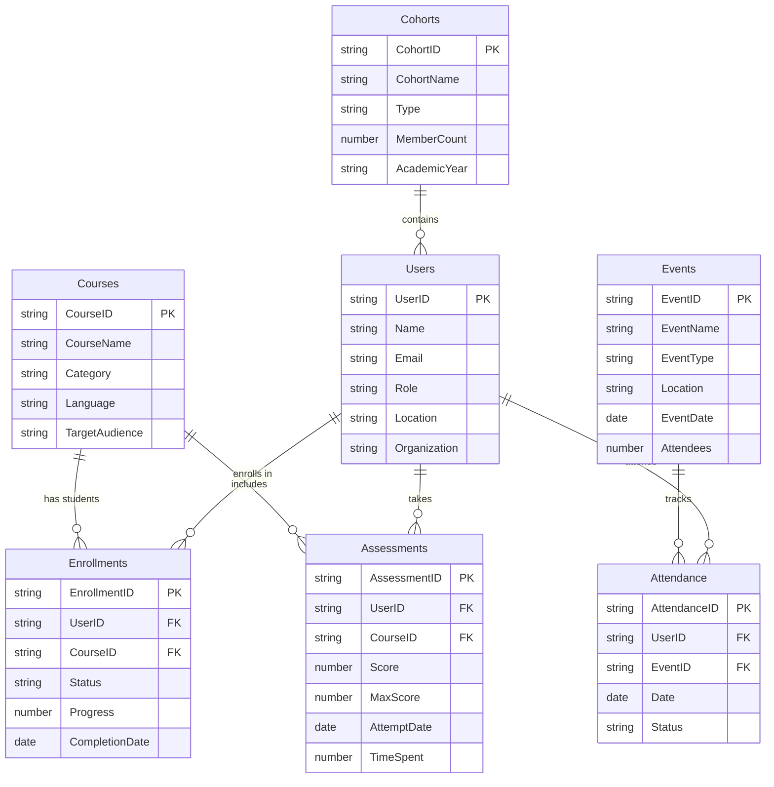

# Shiksha Reports - Business Entity Relationship Diagram

## Simplified Business View

## Business Entity Overview

### 🎯 Core Business Entities

#### 1. **Users** (Students, Teachers, Administrators)
- **Purpose**: Manage all platform users
- **Key Data**: Profile, role, location, organization
- **Business Value**: User management and access control

#### 2. **Courses** (Educational Content)
- **Purpose**: Catalog of available courses
- **Key Data**: Course details, categories, target audience
- **Business Value**: Content management and discovery

#### 3. **Enrollments** (Student Progress)
- **Purpose**: Track student course participation
- **Key Data**: Progress, completion status, certificates
- **Business Value**: Learning analytics and certification

#### 4. **Assessments** (Performance Tracking)
- **Purpose**: Measure learning outcomes
- **Key Data**: Scores, time spent, performance metrics
- **Business Value**: Quality assurance and improvement

#### 5. **Events** (Training Sessions)
- **Purpose**: Manage workshops and training events
- **Key Data**: Event details, scheduling, capacity
- **Business Value**: Event management and engagement

#### 6. **Attendance** (Participation Tracking)
- **Purpose**: Monitor event participation
- **Key Data**: Attendance records, engagement metrics
- **Business Value**: Compliance and engagement tracking

#### 7. **Cohorts** (Group Management)
- **Purpose**: Organize users into groups
- **Key Data**: Group details, member counts, academic years
- **Business Value**: Group-based reporting and analytics

## 📊 Key Business Capabilities

### 1. **Learning Analytics**
- Track student progress across courses
- Measure assessment performance
- Generate completion certificates
- Analyze learning patterns

### 2. **Event Management**
- Schedule training events
- Track attendance and engagement
- Manage recurring events
- Monitor participation rates

### 3. **Reporting & Analytics**
- Cohort-based performance analysis
- Geographic performance tracking
- Multi-organization reporting
- Custom report generation

### 4. **User Management**
- Role-based access control
- Multi-tenant organization support
- Geographic hierarchy management
- Flexible user grouping

## 🎯 Business Benefits

### For Educational Institutions
- **Comprehensive tracking** of student progress
- **Performance analytics** for quality improvement
- **Event management** for training coordination
- **Multi-location support** for distributed operations

### For Administrators
- **Real-time reporting** on all activities
- **Geographic analytics** for resource planning
- **Cohort analysis** for targeted interventions
- **Flexible data structure** for custom requirements

### For Stakeholders
- **Transparent reporting** on educational outcomes
- **Data-driven insights** for decision making
- **Scalable architecture** for growth
- **Comprehensive audit trail** for compliance

## 📈 Reporting Capabilities

### Student Reports
- Individual progress tracking
- Assessment performance
- Course completion rates
- Attendance patterns

### Institutional Reports
- Cohort performance analysis
- Geographic distribution
- Course effectiveness metrics
- Event engagement rates

### Administrative Reports
- Multi-tenant analytics
- Resource utilization
- Compliance tracking
- Custom business metrics 