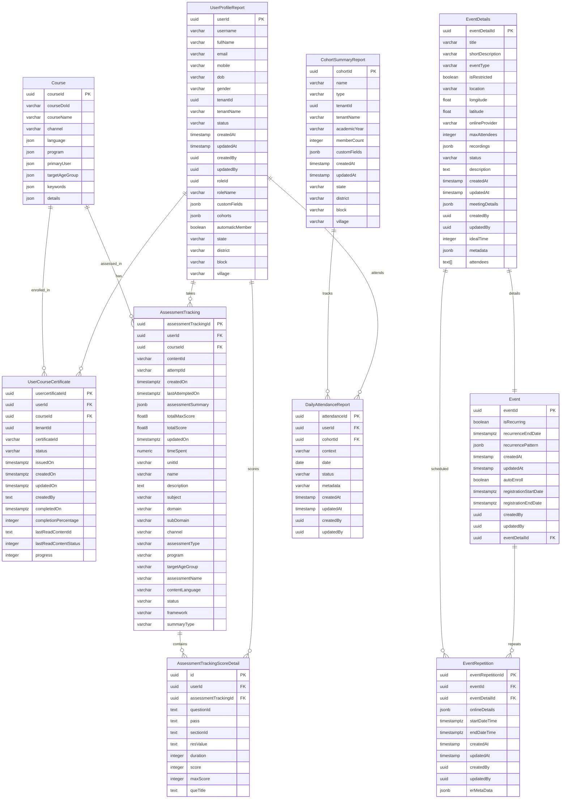

# Shiksha Reports Database Schema

## Entity Relationship Diagram

## Key Relationships

### User-Centric Relationships
- **UserProfileReport** is the central entity for user data
- Users can enroll in multiple courses (`UserCourseCertificate`)
- Users can take multiple assessments (`AssessmentTracking`)
- Users can attend events and have attendance tracked (`DailyAttendanceReport`)

### Course Management
- **Course** contains course metadata and catalog information
- Users enroll in courses through `UserCourseCertificate`
- Course progress and completion are tracked

### Assessment System
- **AssessmentTracking** tracks overall assessment attempts
- **AssessmentTrackingScoreDetail** stores detailed question responses
- Assessments are linked to courses and users

### Event Management
- **Event** manages recurring event patterns
- **EventDetails** contains event information and metadata
- **EventRepetition** handles specific instances of recurring events

### Attendance & Cohort Management
- **DailyAttendanceReport** tracks daily attendance
- **CohortSummaryReport** provides cohort analytics
- Both link to users and cohorts for reporting

## Data Types Summary

- **UUID**: Primary keys and foreign keys
- **Timestamptz**: Timestamps with timezone for events and tracking
- **JSONB**: Flexible data storage for metadata and custom fields
- **JSON**: Array storage for tags, languages, programs
- **Text**: Long-form content and descriptions
- **Varchar**: Standard string fields with length limits
- **Numeric/Float**: Score calculations and measurements
- **Boolean**: Flags and status indicators

## Reporting Focus

This database is designed for educational reporting with:
- User progress tracking across courses
- Assessment performance analytics
- Event attendance and engagement
- Cohort-based reporting and analytics
- Geographic and demographic segmentation 